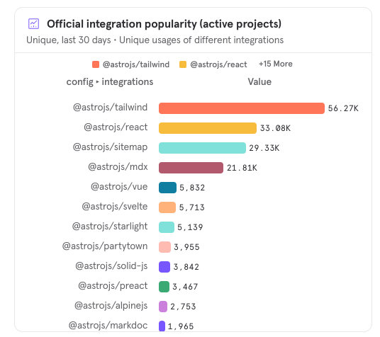

### Official Integrations

Astro maintains several official integrations in a variety of categories which we are responsible for documenting.

However, some integrations are an order of magnitude more popular than others. Understanding the integrations used by our community in their projects may inform how we choose to document our integrations. For example, we may wish to consider a "popular integrations" navigation item for ease of quickly navigating to the docs for our most installed integrations instead of following a strict alphabetical order.

