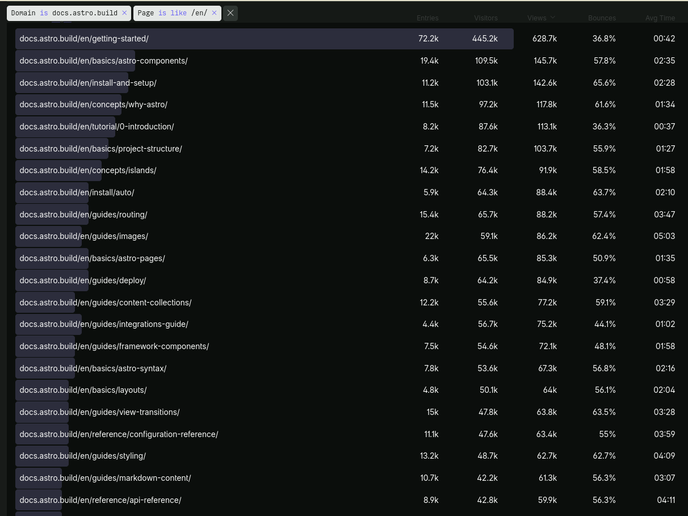
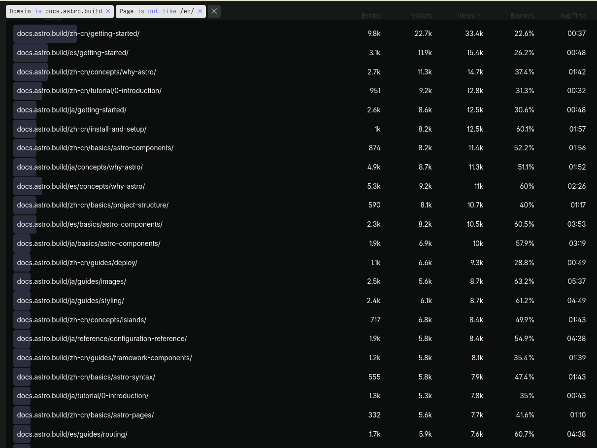
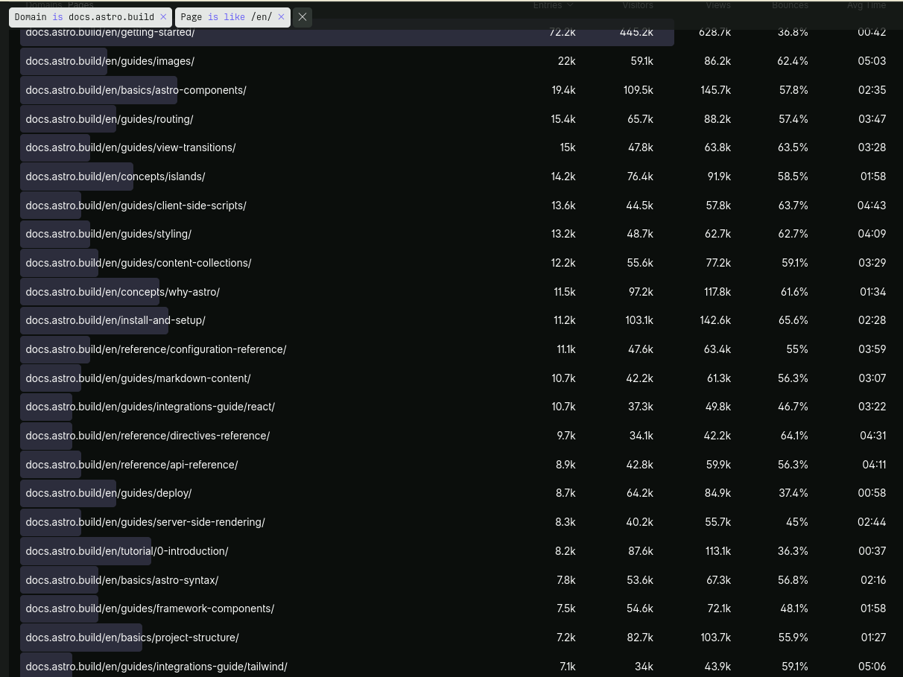
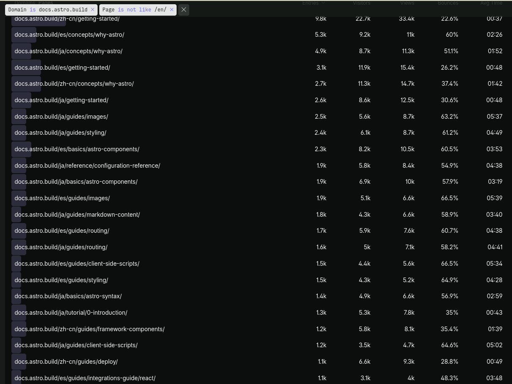
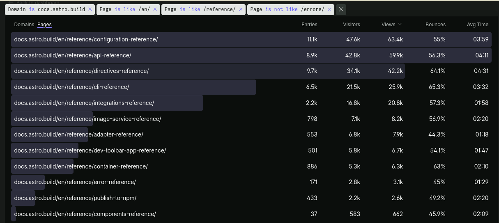
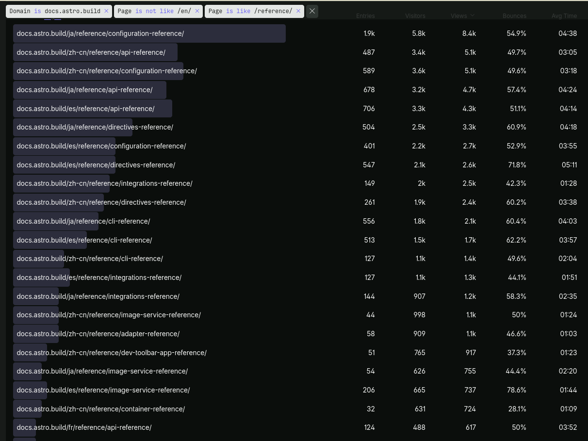
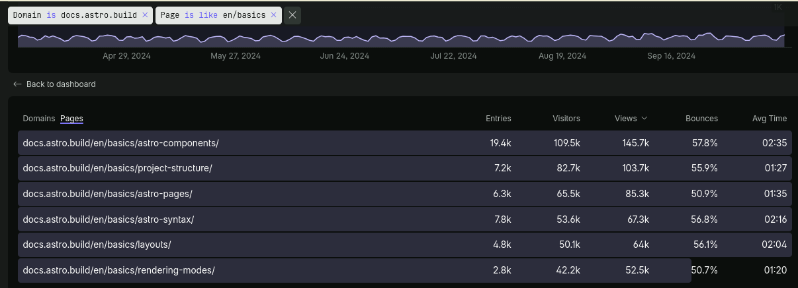
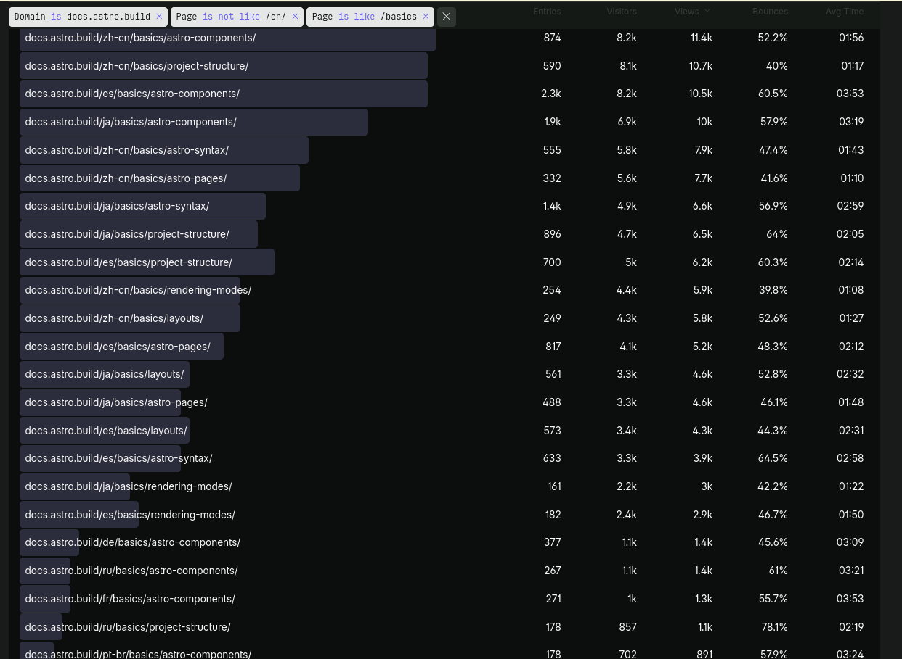
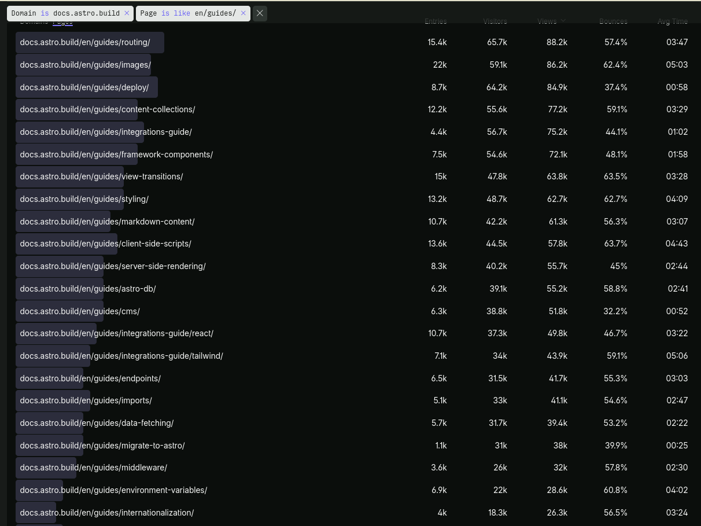
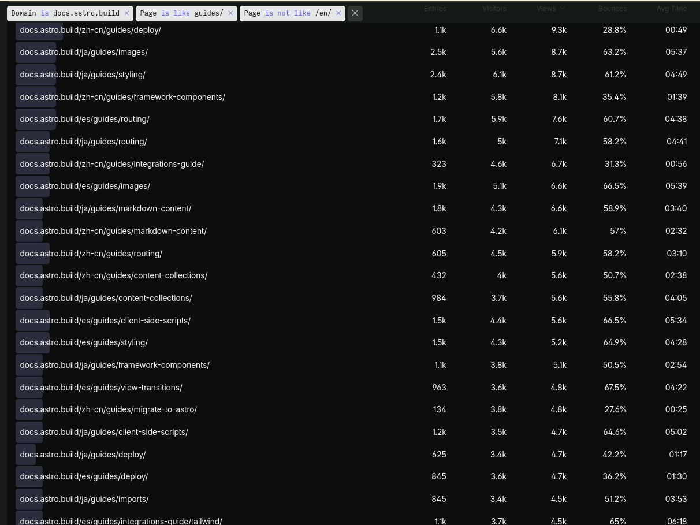

Web traffic stats from approximately the last 6 months. The English only stats show relative traffic for our content, while non-English pages are helpful to know which languages are reading popular pages in their own language, perhaps helping us make decisions about translation efforts.

## Page views

Page views indicate which pages are being visited. This may be because people are interested in learning more about the page content, or may be because they are struggling to understand a concept. This may indicate visiting the docs to troubleshoot or solve a problem with something not working in their project. These metrics cannot easily provide information about whether the content on the page is "good", nor can they distinguish whether a feature is "popular" or "difficult to use." There may be a bias towards longer pages (who match more search hits) or pages that are more prominently displayed in the sidebar (e.g. at the top of a section category).

Whatever the reason, these pages are being hit most frequently, and therefore may indicate pages of particular note when considering maintenance and updating.

English pages visited in the last 6 months, sorted by views:

Non-English pages visited in the last 6 months, sorted by views:

## Page Entries

Page entries indicate which pages people are entering Astro Docs on. This could be from a search engine or a direct link (a docs link posted in a support thread, a blog post describing a new feature etc.) What may be important to consider with pages with high entry counts is that they provide a good way for people to navigate from **inside** the docs site. They may not have landed on the page they needed, or they may wish to explore Astro further and are not guided by a landing page that intentionally helps people decide where and how to navigate to their desired content.

## Reference pages

English reference pages visited in the last 6 months, sorted by views:

Non-English reference pages visited in the last 6 months, sorted by views:

## Basics pages

English basics pages visited in the last 6 months, sorted by views:

Non-English basics pages visited in the last 6 months, sorted by views:

## Guide pages

English guide pages visited in the last 6 months, sorted by views:

Non-English guide pages visited in the last 6 months, sorted by views:

